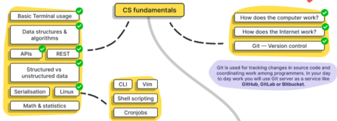

# 다음 로드맵을 따라서 공부한 내용을 정리함
[로드맵 제공 github 주소](https://github.com/datastacktv/data-engineer-roadmap)

## 컴퓨터 과학 기초(CS fundamentals)
- [x] [터미널 기초 사용법](study/basic-terminal-usage.md) 
- [x] [자료 구조](study/data-structure.md)
- [ ] [알고리즘](#)
- [ ] [APIs](#)
- [ ] [REST](#)
- [ ] [정형 데이터 vs 비정형 데이터](#)
- [ ] [Serialisation-직렬화](#)
- [ ] [Linux-OS](#)
    - [ ] [CLI](#)
    - [ ] [Vim](#)
    - [ ] [Shell Scripting](#)
    - [ ] [Cronjobs](#)
- [ ] [컴퓨터 작동 원리](#)
- [ ] [인터넷 작동 원리](#)
- [ ] [산술 & 통계 기본](#)
- [ ] [git 버전 관리](#)
