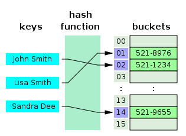

# 자료구조
## 유튜브 영상과 정리된 글을 합쳐서 정리함
### 작성자: 이병률
Content
1. [자료구조란?](#자료구조란?)
2. [자료구조 공부 방법 및 선택 기준](#자료구조-공부-방법-및-선택-기준)
3. [분류](#분류)
4. [참고 사이트](#참고-사이트)
---
## 자료구조란?
### 위키피디아
> 컴퓨터 과학에서 효율적인 접근 및 수정을 가능케 하는 자료의 조직, 관리, 저장을 의미

> 여러 종류가 있으며, 각각의 자료구조는 각자의 연산 및 목적에 맞추어져 있다.

> 어떠한 경우든, 적절한 자료구조의 선택은 필수적이다.
### youtube 정리 영상 중
> 자료구조는 서비스나 애플리케이션에 필요한 데이터를 구조적으로 잘 정리해서 담고 관리하는 것

> 최종적으로 가장 효율적인 방법으로 접근, 수정, 삽입, 삭제 해야 하는 것

> 적절한 자료구조를 사용하는 것이 중요함(코드 실행 시간 2초보다 0.2초)
### 정리
데이터에 가장 효율적으로 접근, 수정, 삽입, 삭제하기 위해 공부해야함

---
## 자료구조 공부 방법 및 선택 기준
### 공부 방법
다음 표에 나와 있는 것을 생각하며 공부해야함
||순서|중복|시간|수정효율|
|---|---|---|---|---|
|예시|등수 매기기|중복 회원가입 방지|로딩을 느끼지 못하게|내용 변경시 소요시간|

추가로 생각해야하는 내용은 3가지가 존재한다.
1. 효율성 - 선택 기준에서 나열할 내용을 토대로 최대한 효율적으로 사용해야한다.
2. 추상화 - 어떻게 작동하는지 아는 것보다 어떻게 사용하는지 아는 것이 중요하다.
3. 재사용성 - 자료구조는 어느 프로그램에서든 사용가능하다
### 선택 기준
위의 방법으로 서로를 비교할 수 있다면, 다음 표를 보자
|처리 시간|크기|활용 빈도|갱신 정도|프로그램 용이성|
|---|---|---|---|---|
|로딩 느끼지 못하게|용량 절약|데이터 접근 횟수|데이터 수정 횟수|얼마나 쉽게 코드를 짜나?|

이와 같은 내용을 상기하며 코드를 짜게 될 것이다.

바로 코딩을 짜는 경우 자료구조로 배열을 쓰는 이유는 프로그램 용이성에 의해 선택된 것이 아닐까..?

---
## 분류
분류 방법은 크게 구현 방법과 형태로 나눌 수 있다.
### 구현
- [배열](#배열) - 순서대로 저장된 자료
- 튜플 - 다양한 자료를 담을 수 있는 배열
- [연결 리스트](#연결-리스트) - 자료가 다음 자료를 가리킴
    - 단일
    - 이중
    - 원형
- [해시 테이블](#해시-테이블) - key가 자료를 가리킴
### 형태
- 선형
    - [스택](#스택)
    - [큐](#큐)
        - 우선순위 큐
    - [덱](#덱)
- 비선형
    - [그래프](#그래프)
        - 유향
        - 무향
    - [트리](#트리)
        - 이진
        - 힙

---
## 배열
배열은 연속적으로 데이터를 저장하는 자료 구조

위치를 알고 있음으로 바로 접근할 수 있지만, 삽입과 삭제시 다른 요소도 이동하게 됨
### 처리 시간(Big O)
|접근|수정|삽입|삭제|
|---|---|---|---|
|1|1|n|n|
### Key Point 확인하기
|순서|중복|프로그램 용이성|
|---|---|---|
|없음|가능|가장 쉬움|

### 예시
> ## 자판기 시스템
> - 버튼이 나열된 자판기에서 원하는 물건에 버튼을 누르면 그 물건이 바로 나옴(접근성)
> - 하지만, 새로운 물건을 팔려면 다른 물건과 교체하는 것만 가능하다(수정)
> - 왜냐하면 자판기에는 일정한 공간만큼 물건을 진열할 수 있기 때문이지(삽입 불가)
> - 자판기에 더 이상 진열한 물건이 없으면 물건을 넣지 않을 수 는 있다(수정)
> - 하지만, 자판기의 물리적인 공간을 줄일 수 는 없다(삭제 불가)
> - 자판기에 어떤 물건을 넣으면 딱 정리가 되지 않지만(순서 없음)
> - 똑같은 물건을 넣는 것에는 문제가 되지 않는다(중복 가능)

---
## 연결 리스트
연결 리스트는 노드 단위로 자료와 다음 노드를 가리키는 참조값으로 구성된다, **즉 다음 자료의 위치를 알고 있다.**

요소를 삭제하거나 새 요소를 삽입하는 것은 쉽지만, 원하는 요소로 바로 이동할 수 없다. 그 때문에 수정도 쉽게 이루어지지 않는다.

연결 리스트는 단순, 원형, 이중 등 다양한 방법으로 만들 수 있는데 상황에 따라 알맞은 요소를 사용하면 된다.
### 처리 시간(Big O)
|접근|수정|삽입|삭제|
|---|---|---|---|
|n|n|1|1|
### Key Point 확인하기
|순서|중복|프로그램 용이성|
|---|---|---|
|없음|가능|쉬움|

### 예시
> ## 친구 전화번호 찾기(적당한 예시가 아님..)
> - 내가 길동이의 전화번호를 알고 싶어서 민준이에게 물어봤다. 민준이는 서준이에게 물어보고 서준이는 예준이에게 물어봤다.. 결국 길동이의 전화번호는 연락을 타고 타서 알게 되었다.(접근성 낮음)
> - 만약에 내가 서연이의 전화번호를 알고 싶으면 단순히 바로 저장하면 된다.(삽입 쉬움)
> - 또 민준이의 전화번호를 지우고 싶으면 바로 지우면 된다.. 단 서준이의 전화번호를 저장하면 더 좋을 것 같지만..(삭제 쉬움)

---
## 해시 테이블
key 값을 특별한 수식을 거쳐 데이터에 접근하는 방식을 사용

이 방법은 수식의 결과가 같지 않으면 접근, 수정, 삽입, 삭제 모두 O(1)로 끝낼 수 있는 궁극에 방법이지만, 같은 결과값이 나올 수 있다.

이것을 충돌이라고 말하는데 충돌이 났을 때는 크게 2가지 방법을 통해 해소한다.
1. 분리 연결법(Separate Chaining)
    > 분리 연결법은 같은 부분을 가르키면 그부분에 연결 리스트 형태로 붙여준다.
    >
    > 버킷 부분에서 추가로 이어진다고 생각하면 좋겠다.
2. 개방 주소법(Open addressing)
    > 배열처럼 다음 빈칸을 찾아내어 삽입한다.
    >
    > 버킷 부분에서 밑으로 내려가며 확인한다고 생각하면 되겠다.
### 처리 시간(Big O)
|접근|수정|삽입|삭제|
|---|---|---|---|
|1|1|1|1|
### Key Point 확인하기
|순서|중복|프로그램 용이성|
|---|---|---|
|없음|key = 불가능, value 가능|쉬움|

### 예시
> ## 친구 전화번호 찾기(적당한 예시가 아님..)
> - 내가 길동이의 전화번호를 알고 싶어서 전화번호부에 검색을 하면 바로 나온다(접근성)
> - 전화번호가 바뀌면 바로 바꾸면 된다(수정)
> - 새로운 친구가 전화번호를 주면 새로 추가하면 된다(삽입)
> - 친구 이름이 같으면 1, 2 등을 추가하여 삽입한다(충돌 해결법 == 개방 주소법) [정확한 표현은 아님]

---
## 스택
LIFO 후입선출 방식의 자료구조

대표적으로 책을 쌓는 것과 같은 방식이다.

구조에 문제에서 처리 시간을 확인하거나 Key Point를 확인하는 것 보다 어떻게 사용할지 알아야 할 듯하다.
### 예시
> ## [백준 문제](https://www.acmicpc.net/problem/10799)
> - 통로가 한 곳 밖에 없는 공간에서 사람이 들어가고 나간 횟수를 센다던가
> - 문제와 같이 지금까지 스택에 넣어둔 정보를 읽고 저장한거나,
> - 순서가 뒤죽박죽으로 들어오는 2가지 내용을 주고 가능한지 묻는 등에 문제가 존재한다.
> - 다중 스택을 이용하고 순서와 중복을 확인하면서 코드를 짜기도한다. [링크](https://www.acmicpc.net/problem/2841)
---
## 큐
FIFO 선입선출 방식의 자료구조

대표적으로 사람들이 줄을 서서 대기하는 것과 같은 방식이다.

우선순위 큐는 큐라는 이름을 가진 것과 다르게 내부적으로 트리의 형태를 가지고 있다. 우선순위가 존재함으로 꺼낼 때 걸리는 시간이 최소화 된다. 이 부분은 [트리](#트리) 에서 추가 설명한다.
### 예시
> ## [요세푸스 문제](https://www.acmicpc.net/problem/1158)
> - 이 문제는 사람이 둘러 앉아서 숫자를 세고 정해진 숫자가 되면 사람이 빠지게 된다.
> - 반복하면 마지막 한 사람이 남는데 그 사람을 찾는 문제이다.
> - 배열로 구현하면 N^2, 연결 리스트는 NK 시간이 걸린다.
> - 빼고 넣고를 반복하면서 순서를 미룰 일이 있다면 큐가 제격이다.
> - 겁나 재밌는 문제도 존재한다. [링크](https://www.acmicpc.net/problem/19644)
> - 행동중 1개를 선택하게 하고 끝 없이 다가오는 적을 쓰러트려라 queue 처럼 끝없이 온다..
> - 교통량 순서대로 들어온 것을 확인하는 다중 큐를 써야하는 경우가 생긴다[링크](https://www.acmicpc.net/problem/11116)
---
## 덱
덱은 큐를 앞뒤로 연결한 것
양 끝단에서 자료를 입력하고 출력할 수 있다.

스택과 큐를 합친 형식이다.
### 예시
> ## 부당한 퍼즐
> - 뒤집기와 밀기등 에 일을 동시에 해야하는 경우
> - 추천 [문제](https://www.acmicpc.net/problem/15501)
---
## 그래프
그래프는 정점과 정점을 연결하는 변으로 구성된 자료구조 입니다.

그래프는 현실 세계에 있는 내용을 표현하기에 좋다.

2차원 상에 거리를 구한다던가.. 또는 복잡한 다중 연결 상태를 표현하기 좋다.

앞서 설명한 전화번호부도 그래프 형태로 나타낼 수 있을 것이다.

그래프도 물론 연결 리스트 방식으로 구현이 가능하고 배열로 구현이 가능하다.

때에 맞는 자료구조를 사용하여 제작할 필요가 있다.
### 예시
> ## 지도
> - 지도상에 각 버스 정류장을 정점이라고 생각해보자.
> - 버스 정류장을 연결해주는 버스는 변이라고 할 수 있다.
> - 여기서 버스 정류장간 거리를 생각하게 된다면 가중치 그래프가 탄생한다.
> - 만약 버스가 한방향으로만 이동한다면 방향이 존재하는 그래프가 탄생한다.
---
## 트리
트리는 그래프의 일종으로 다른 노드 간에 연결을 1:n으로 강제한다.

대표적으로 이진 트리가 존재하며 그 외로도

avl 트리, 신장 트리, B-트리 힙 등으로 연결된다.

### 예시
> ## 트리는 사용법이 무궁무진하다..
> - 큰 또는 작은 순으로 정리하면서 넣으면 힙트리가 되고
> - 트리의 높이를 일정하게 맞추기 위해서는 avl 트리를 사용한다.
> - 가중치 그래프에서 최소 비용으로 모든 노드를 연결 할 때는 신장 트리를 사용한다.
> - 트리에 대한 자세한 설명은 [링크](https://gmlwjd9405.github.io/2018/08/12/data-structure-tree.html) 통해 알 수 있다..
---
## 참고 사이트
**[글 자료구조를 종류별로 다룸(더 정리가 잘 되어 있음)](https://gmlwjd9405.github.io/2018/08/12/data-structure-tree.html)**

[알고리즘 기초 정보{자료구조}](https://librewiki.net/wiki/%EC%8B%9C%EB%A6%AC%EC%A6%88:%EC%88%98%ED%95%99%EC%9D%B8%EB%93%AF_%EA%B3%BC%ED%95%99%EC%95%84%EB%8B%8C_%EA%B3%B5%ED%95%99%EA%B0%99%EC%9D%80_%EC%BB%B4%ED%93%A8%ED%84%B0%EA%B3%BC%ED%95%99/%EC%95%8C%EA%B3%A0%EB%A6%AC%EC%A6%98_%EA%B8%B0%EC%B4%88#.EB.8B.A4.EC.9D.8C_.EB.8B.A8.EA.B3.84.EB.A1.9C)

**[글 이 글에 큰틀을 따라감](http://www.incodom.kr/자료구조)**

**[글 위키 자료구조 설명](https://ko.wikipedia.org/wiki/자료_구조)**

**[영상 자료구조와 알고리즘을 같이 다뤄 쉽게 설명함](https://www.youtube.com/watch?v=okHGRlgR8ps)**